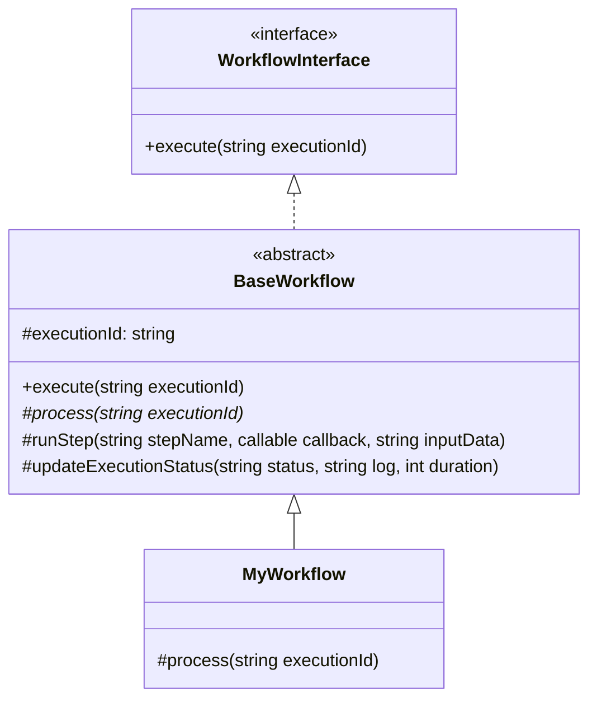
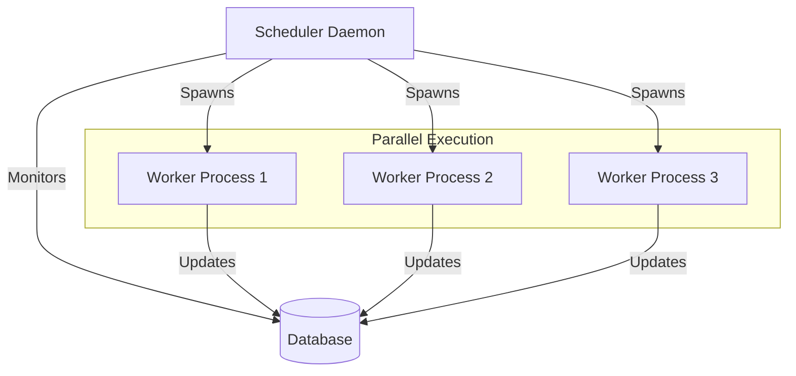

# WorkFlow Scheduler Plugin

A CakePHP plugin to manage and execute automated workflows, similar to make.com scenarios.

## Features
- **Workflow Management**: Define workflows with specific schedules.
- **Auto-Discovery**: Workflows are automatically discovered from `App\Workflow` namespace - no manual registration needed!
- **Parallel Execution**: Run multiple workflows simultaneously with configurable concurrency limits (default: 5 concurrent executions).
- **Cross-Platform**: Works on both Windows (development) and Linux (production) with optimized process management.
- **Execution Tracking**: Track every execution of a workflow, including status (pending, running, completed, failed).
- **Step Logging**: Log individual steps within a workflow execution with detailed input/output data and duration.
- **Visual Interface**: View workflow status and execution history via a web UI with filtering and pagination.
- **Live Updates**: Real-time polling of execution status while workflows are running with animated loaders.
- **Manual Execution**: Trigger workflows manually from the UI with one-click execution.
- **JSON Data Display**: View input/output data in formatted JSON with accordion UI.
- **Status Indicators**: Color-coded status badges for completed, failed, running, and pending executions.
- **Production Ready**: Includes systemd and Supervisor configuration files for Linux deployment.

## Installation

1.  **Load the Plugin**
    In your `src/Application.php` or via command line:
    ```bash
    bin/cake plugin load WorkFlowScheduler
    ```

2.  **Run Migrations**
    Create the necessary database tables:
    ```bash
    bin/cake migrations migrate -p WorkFlowScheduler
    ```

3.  **Seed Sample Data** (Optional)
    ```bash
    bin/cake migrations seed -p WorkFlowScheduler
    ```

4.  **Setup Cron Job** (Optional - for scheduled execution)
    To execute workflows on their schedule, add the following to your crontab (e.g., run every minute):
    ```bash
    * * * * * cd /path/to/your/app && bin/cake work_flow_scheduler.scheduler --once
    ```

## Quick Start

### 1. Create a New Workflow

Use the bake command to generate a workflow template:

```bash
bin/cake work_flow_scheduler.bake_scheduler MyNewWorkflow
```

This creates `src/Workflow/MyNewWorkflowWorkflow.php` with a complete template.

### 2. Register in Database

Add your workflow to the database:

```sql
INSERT INTO workflows (id, name, description, schedule, status, created, modified)
VALUES (UUID(), 'MyNewWorkflow', 'Description of my workflow', '* * * * *', 1, NOW(), NOW());
```

**Note**: The workflow name in the database must match the class name (without the "Workflow" suffix).
- Database name: `MyNewWorkflow`
- Class name: `MyNewWorkflowWorkflow`
- File: `src/Workflow/MyNewWorkflowWorkflow.php`

### 3. That's It!

The workflow will be **automatically discovered** - no manual registration needed! Just execute it from the UI or let the scheduler run it.

## Directory Structure

```
your-app/
├── src/
│   └── Workflow/                          ← Your workflows go here
│       ├── NotifyStuckedProcessWorkflow.php
│       └── MyNewWorkflowWorkflow.php
│
└── plugins/
    └── WorkFlowScheduler/                 ← Plugin (don't modify)
        ├── config/
        │   ├── Migrations/
        │   └── Seeds/
        ├── src/
        │   ├── Command/
        │   │   ├── BakeSchedulerCommand.php
        │   │   └── SchedulerCommand.php
        │   ├── Controller/
        │   ├── Model/
        │   ├── Plugin.php
        │   └── Workflow/
        │       └── WorkflowInterface.php  ← Interface only
        ├── templates/
        ├── CHANGELOG.md
        └── README.md
```

## Usage

### Accessing the UI
Navigate to `/work-flow-scheduler` to view your workflows and their execution history.

Example: `http://localhost:8765/work-flow-scheduler`

### Routes
- `/work-flow-scheduler/` - List of all workflows with last execution status
- `/work-flow-scheduler/{id}` - Workflow details with execution history (filtered, paginated)
- `/work-flow-scheduler/execution/{id}` - Single execution details with steps and JSON data
- `/work-flow-scheduler/{id}/execute` - Manual execution trigger (POST)
- `/work-flow-scheduler/status-all` - API endpoint for live status updates
- `/work-flow-scheduler/{id}/executions` - API endpoint for execution list

## Creating Workflows

### Method 1: Using Bake Command (Recommended)

```bash
bin/cake work_flow_scheduler.bake_scheduler MyNewWorkflow
```

This generates a complete workflow template in `src/Workflow/MyNewWorkflowWorkflow.php`.

### Method 2: Manual Creation

Create a new class in `src/Workflow/` that extends `WorkFlowScheduler\Workflow\BaseWorkflow`:

```php
<?php
declare(strict_types=1);

namespace App\Workflow;

use WorkFlowScheduler\Workflow\BaseWorkflow;

class MyNewWorkflowWorkflow extends BaseWorkflow
{
    /**
     * Implement the process method with your workflow logic
     */
    protected function process(string $executionId): void
    {
        // Step 1
        $result1 = $this->runStep('Step 1: Initialization', function() {
            // Your logic here
            return ['status' => 'initialized'];
        });

        // Step 2
        $result2 = $this->runStep('Step 2: Processing', function() use ($result1) {
            // Your logic here
            return ['status' => 'processed'];
        }, json_encode($result1));
    }
}
```

### Workflow Structure Diagram



## Auto-Discovery

Workflows are automatically discovered from the `App\Workflow` namespace using the following pattern:

- **Database name**: `MyNewWorkflow`
- **Class name**: `App\Workflow\MyNewWorkflowWorkflow`
- **File location**: `src/Workflow/MyNewWorkflowWorkflow.php`

The scheduler automatically:
1. Takes the workflow name from the database (e.g., `InvoiceEnforcement`)
2. Appends `Workflow` to create the class name (e.g., `NotifyStuckedProcessWorkflow`)
3. Looks for the class in `App\Workflow` namespace
4. If not found, tries without the `Workflow` suffix as a fallback

**No manual registration required!** Just create the class and add it to the database.

## Workflow Step Structure

Each step logs:
- **Step Name**: Descriptive name
- **Status**: pending, running, completed, failed
- **Input Data**: JSON data passed to the step
- **Output Data**: JSON data returned from the step
- **Started/Completed**: Timestamps
- **Duration**: Execution time in milliseconds

## UI Features

### Workflows List Page
- View all workflows with their schedules
- Toggle workflow status (Active/Inactive)
- See last execution status with date/time
- Live running indicator for active executions
- Color-coded status badges (Green=Completed, Red=Failed, Blue=Running/Pending)
- Auto-refreshes every 5 seconds

### Workflow Details Page
- View workflow information and settings
- Edit schedule inline
- Filter execution history by status and date range
- Paginated execution list with live updates
- One-click manual execution
- Auto-refreshes every 5 seconds

### Execution Details Page
- Real-time status updates with animated loaders
- Step-by-step execution progress
- View input/output data for each step
- Execution duration and timestamps
- Navigation links to workflow and list pages
- Auto-refreshes every 2 seconds while running

## Running the Scheduler

### Manual Execution (via UI)
Navigate to workflow details and click "Execute Workflow Manually"

### Daemon Mode (Continuous)
```bash
bin/cake work_flow_scheduler.scheduler
```

### One-Time Run (Recommended for Cron)
```bash
bin/cake work_flow_scheduler.scheduler --once
```

### Specific Workflow
```bash
bin/cake work_flow_scheduler.scheduler MyNewWorkflow
```

### Cron Job Setup
```bash
# Run every minute
* * * * * cd /path/to/app && bin/cake work_flow_scheduler.scheduler --once

# Or run as daemon (starts once and runs continuously)
@reboot cd /path/to/app && bin/cake work_flow_scheduler.scheduler
```

## Database Schema

### Tables
- **workflows**: Workflow definitions (UUID primary key)
  - `id` (UUID)
  - `name` (VARCHAR) - Must match class name without "Workflow" suffix
  - `description` (TEXT)
  - `schedule` (VARCHAR) - Cron expression
  - `status` (TINYINT) - 1=Active, 0=Inactive
  - `last_executed` (DATETIME)
  - `created`, `modified` (DATETIME)

- **workflow_executions**: Execution records
  - `id` (UUID)
  - `workflow_id` (UUID)
  - `status` (ENUM: pending, running, completed, failed)
  - `started`, `completed` (DATETIME)
  - `duration` (INT) - Milliseconds
  - `log` (TEXT)

- **execution_steps**: Individual step logs
  - `id` (INT)
  - `execution_id` (UUID)
  - `step_name` (VARCHAR)
  - `status` (ENUM: pending, running, completed, failed)
  - `input_data`, `output_data` (TEXT) - JSON
  - `started`, `completed` (DATETIME)
  - `duration` (INT) - Milliseconds

## API Endpoints

All endpoints return JSON:

- `GET /work-flow-scheduler/status-all` - Get all workflow statuses with last execution info
- `GET /work-flow-scheduler/{id}/executions` - Get execution list for a workflow
- `POST /work-flow-scheduler/{id}/toggle-status` - Toggle workflow active/inactive
- `POST /work-flow-scheduler/{id}/update-schedule` - Update workflow schedule
- `POST /work-flow-scheduler/{id}/execute` - Trigger manual execution

## Polling Intervals

| Page | Polling Interval | Stops When |
|------|-----------------|------------|
| Workflows List | 5 seconds | Never (continuous) |
| Workflow Details | 5 seconds | Never (continuous) |
| Execution Details | 2 seconds | Status is completed/failed |

## Example Workflow

See `src/Workflow/NotifyStuckedProcessWorkflow.php` for a complete example that demonstrates:
- Multi-step workflow execution
- External API calls (weather data)
- Data logging
- Error handling
- Step timing with `sleep()` for demonstration

## Parallel Execution & Deployment

The scheduler supports **parallel execution** of workflows, allowing multiple workflows to run simultaneously.

### How It Works



### Running the Scheduler

#### Daemon Mode (Continuous)
```bash
# Default: 5 concurrent workflows
bin/cake work_flow_scheduler.scheduler

# Custom concurrency limit
bin/cake work_flow_scheduler.scheduler --max-concurrent=10
```

#### One-Time Run (For Cron)
```bash
# Process all pending, then exit
bin/cake work_flow_scheduler.scheduler --once

# With custom concurrency
bin/cake work_flow_scheduler.scheduler --once --max-concurrent=3
```

#### Specific Workflow
```bash
bin/cake work_flow_scheduler.scheduler MyNewWorkflow
```

### Performance Comparison

| Scenario | Sequential | Parallel (5 workers) |
|----------|-----------|---------------------|
| 5 workflows × 2 min each | **10 minutes** | **2 minutes** |
| 10 workflows × 1 min each | **10 minutes** | **2 minutes** |
| 1 long (10 min) + 5 short (30s) | **12.5 minutes** | **10.5 minutes** |

### Production Deployment

#### Option 1: Systemd Service (Recommended for Linux)

1. **Copy service file:**
```bash
sudo cp plugins/WorkFlowScheduler/config/workflow-scheduler.service /etc/systemd/system/
```

2. **Edit the service file:**
```bash
sudo nano /etc/systemd/system/workflow-scheduler.service
```

Update these lines:
```ini
User=www-data                                    # Your web server user
WorkingDirectory=/var/www/your-app              # Your app path
ExecStart=/usr/bin/php bin/cake work_flow_scheduler.scheduler --max-concurrent=5
```

3. **Enable and start:**
```bash
sudo systemctl daemon-reload
sudo systemctl enable workflow-scheduler
sudo systemctl start workflow-scheduler
```

4. **Check status:**
```bash
sudo systemctl status workflow-scheduler
sudo journalctl -u workflow-scheduler -f  # View logs
```

#### Option 2: Supervisor

1. **Copy configuration:**
```bash
sudo cp plugins/WorkFlowScheduler/config/workflow-scheduler.conf /etc/supervisor/conf.d/
```

2. **Edit configuration:**
```bash
sudo nano /etc/supervisor/conf.d/workflow-scheduler.conf
```

Update the paths and user.

3. **Start:**
```bash
sudo supervisorctl reread
sudo supervisorctl update
sudo supervisorctl start workflow-scheduler
```

4. **Check status:**
```bash
sudo supervisorctl status workflow-scheduler
sudo supervisorctl tail -f workflow-scheduler  # View logs
```

#### Option 3: Cron (Simple, No Daemon)

```bash
# Run every minute
* * * * * cd /var/www/app && bin/cake work_flow_scheduler.scheduler --once --max-concurrent=5
```

**Note:** With cron, each run is independent. The `--max-concurrent` limit applies per cron execution.

### Monitoring

#### Check Running Workflows (Linux)
```bash
# View all scheduler processes
ps aux | grep work_flow_scheduler

# Count running workflows
ps aux | grep execute_workflow | wc -l

# View process tree
pstree -p | grep cake
```

#### Resource Monitoring
```bash
# Monitor CPU and memory
top -u www-data

# Detailed process info
htop -u www-data
```

### Configuration

#### Adjust Max Concurrent Executions

The default is 5 concurrent workflows. Adjust based on your server resources:

```bash
# Light server (1-2 GB RAM)
--max-concurrent=2

# Medium server (4-8 GB RAM)
--max-concurrent=5

# Heavy server (16+ GB RAM)
--max-concurrent=10
```

**Rule of thumb:** 
- Each workflow may use 50-200 MB RAM
- Monitor your server and adjust accordingly
- Start conservative and increase if needed

## Troubleshooting

### Workflow not executing
1. Check workflow status is Active (1) in database
2. Verify workflow class exists in `src/Workflow/`
3. Ensure class name matches: `{DatabaseName}Workflow`
4. Check scheduler is running: `bin/cake work_flow_scheduler.scheduler`

### Auto-discovery not working
1. Verify namespace is `App\Workflow`
2. Check class implements `WorkflowInterface`
3. Ensure class name ends with `Workflow`
4. Database name should be class name without `Workflow` suffix

### Steps not logging
1. Verify you're using `runStep()` method
2. Check database connection
3. Ensure `execution_steps` table exists

## Requirements
- CakePHP 5.x
- PHP 8.1 or higher
- MySQL/MariaDB with UUID support

## Version
**1.0.0** - November 30, 2025

## License
MIT License

## Support
For issues and feature requests, please create an issue in the repository.
